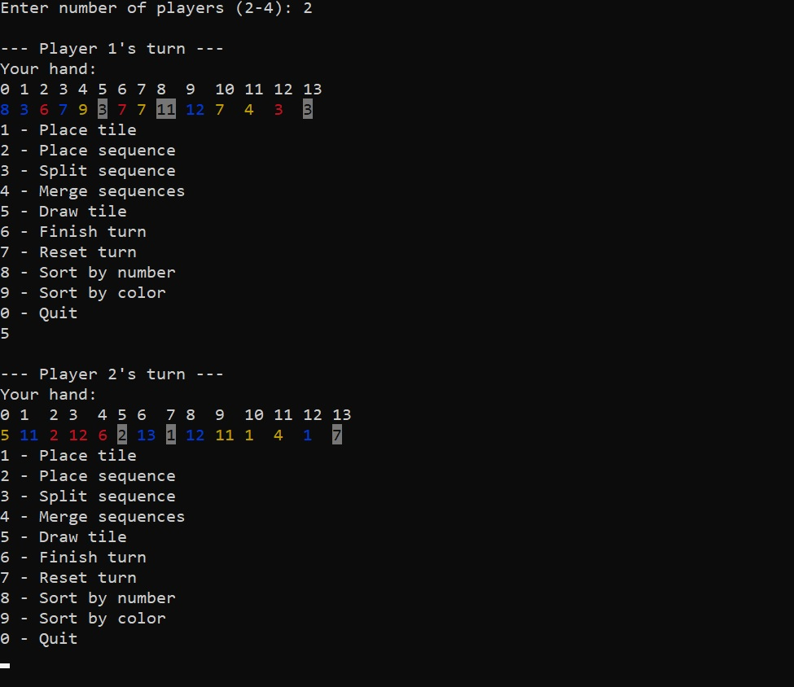

# 🃏 Rummikub Console Game

A console-based reiteration of the classic Rummikub board game, built with C++ utilizing strict Object-Oriented Programming (OOP) principles. 

## 📸 Preview


## ✨ Features
* **Multiplayer Support:** Playable locally with 2 to 4 players.
* **Rich Terminal UI:** Features color-coded console output to easily distinguish tile suits (Blue, Red, Yellow, and Black).
* **Advanced Game Logic:** Fully implements the complex rules of Rummikub, allowing players to:
  * Place individual tiles or entire sequences.
  * Split existing board sequences.
  * Merge sequences together.
* **Hand Management:** Players can dynamically sort their current hand by color or by number for easier strategic planning.
* **Turn Safeguards:** Includes a "Reset turn" feature to allow players to undo actions before finalizing their turn.

## 🛠️ Tech Stack
* **Language:** C++
* **Core Concepts:** Object-Oriented Programming (OOP), Data Structures, Standard Template Library (STL)

## 🚀 Getting Started

### Prerequisites
You will need a C++ compiler (such as GCC, Clang, or MSVC) installed on your machine.

### Installation & Execution
1. Clone the repository:
```Bash
   $ git clone https://github.com/EvaCheer/Rummikub.git
```
2. Navigate to the project directory:
```Bash
  $ cd Rummikub
```
3. Compile the code (Note: Adjust this command depending on your specific compiler or if you use a Makefile/CMake):
```Bash
  $ g++ -o rummikub *.cpp
```
4. Run the executable:
```
  Windows: $ rummikub.exe

  Linux/Mac: $ ./rummikub
```
